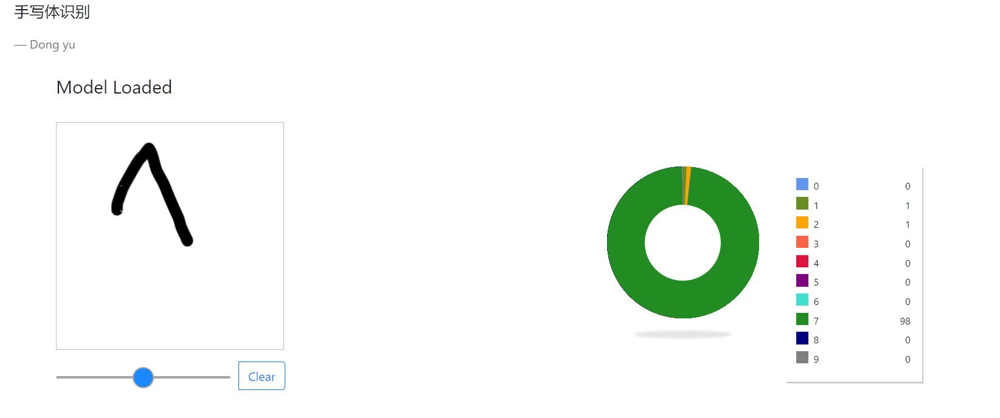
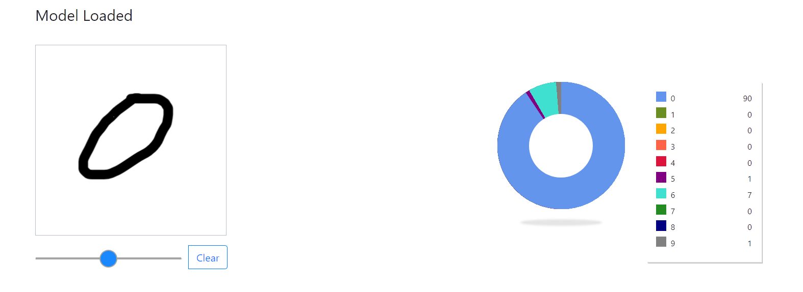
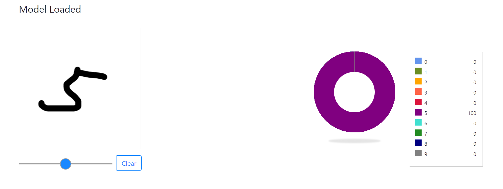

# 浏览器手绘识别0~9数字
* 首先使用LeNet-5模型对mnist数据集进行训练，完成后用tensorflowjs转换模型得到打包好的model，前端tfjs调用模型进行预测
* 该demo效果一般，因为真实场景下的数据和训练集(mnist)的分布并不能很好的保持一致
* [demo地址](https://mxzf0213.github.io/numIdentify/)
* update:最新版使用ImageDataGenerator加强数据，训练集310000，测试集60000，加强数据表现为水平、竖直平移比例0.3，旋转角度40，放缩比例0.3

